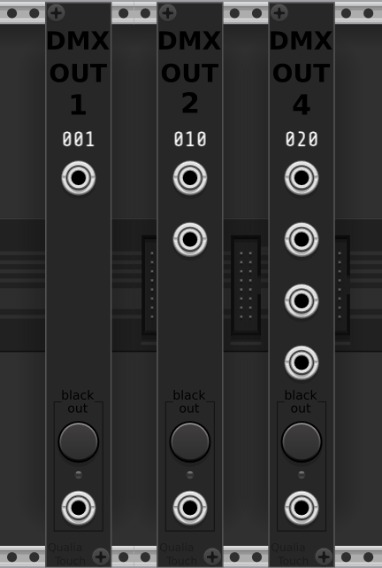

# QualiaLight - a VCV Rack 2 plugin

## About

QualiaLight is a VCV Rack 2 plugin with modules allowing to send DMX512 data to real-life lighting fixtures through an adapter.

QualiaLight is part of the QualiaTouch project. QualiaTouch is about giving the machine perception and action capabilities with the outside world.

## DMX modules

If you know about the DMX512 protocol, then you've already understood what these modules do. You'll need an USB -> DMX OUT adapter and an appropriate driver. Documentation [here](doc/dmx.md).

- DMX OUT 1 : allows to send DMX data on one channel from the computer.
- DMX OUT 2 : same with 2 consecutive channels.
- DMX OUT 4 : same with 4 consecutive channels.

## Contributing

Contributions are much welcome! Especially from C++ experienced people, who'll know how to optimize the execution, clean the code, make it portable and most importantly, prevent memory leaks. Also from svg-friendly people, to improve the module widgets.

## License

As recommended by VCV, QualiaTouch is released under the GNU General Public License v3.0 (or later).

## Thanks

The peole who coded the drivers, the libraries, deserve praise for facilitating the work of many people. Also, Linus Torvalds.
